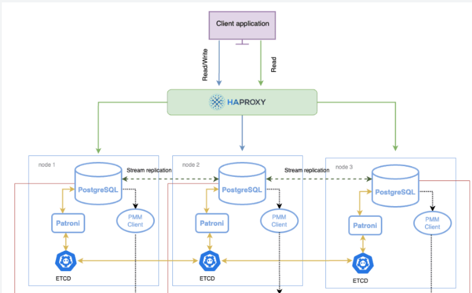
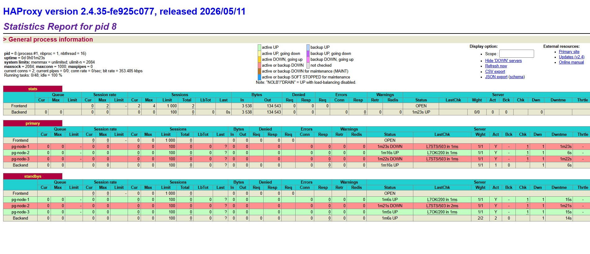

# 🚀 Topic 121. Dockerized PostgreSQL HA Cluster: "High Availability Retail" 🛒

Chào mừng bạn đến với dự án **High Availability PostgreSQL Cluster** chuyên dụng cho hệ thống Bán lẻ! Dự án này triển khai một hạ tầng cơ sở dữ liệu có độ tin cậy và sẵn sàng cao (High Availability) sử dụng **Patroni**, **etcd**, và **HAProxy** được đóng gói hoàn chỉnh bằng **Docker Compose**.

---

## 🏗️ Kiến trúc cụm (Cluster Architecture)

Hệ thống được thiết kế theo mô hình Cloud-Native tiêu chuẩn bao gồm:
*   **3 Nodes PostgreSQL (v14):** Được quản lý bởi **Patroni** để tự động hóa việc đồng bộ dữ liệu và bầu cử Leader.
*   **etcd (DCS - Distributed Consensus Store):** Nơi lưu trữ trạng thái của cụm và thực hiện bầu chọn Primary Node.
*   **HAProxy (Load Balancer & Routing):** Phân tách luồng Đọc/Ghi (Read/Write Splitting):
    *   **Port 5000 (Write):** Chỉ định tuyến đến duy nhất node Primary.
    *   **Port 5001 (Read):** Cân bằng tải xoay vòng (Round-robin) giữa các node Standby (Replica).
    *   **Port 7000 (Dashboard):** Giao diện quản lý trực quan trạng thái định tuyến của HAProxy.


---

## 📊 Mô tả Nhiệm vụ (Task & Dataset)

*   **Dataset:** `Retail_Sales.csv` (Dữ liệu bán lẻ mẫu).
*   **Nhiệm vụ:** Triển khai cụm HA PostgreSQL 3-node, thiết lập HAProxy điều phối đọc/ghi.
*   **Phân tích sự cố:** Giả lập sự cố ngắt container Primary đột ngột ("Container Kill") và kiểm tra khả năng tự phục hồi.
*   **Chỉ số đo lường (Metric):** Đo đạc thời gian failover thực tế (Downtime tính bằng giây) trước khi node Secondary lên nắm quyền.

---

## 🛠️ Hướng dẫn Cài đặt & Khởi động cụm (Setup)
### 🛠️ 0. Set up môi trường
```bash
# Đối với Windows CMD
git clone https://github.com/minh7709/Dockerized-HA-Cluster.git
cd Dockerized-HA-Cluster
```
### 📥 1. Khởi động Cụm với Docker Compose
Mở Terminal tại thư mục gốc của dự án và khởi chạy lệnh sau để build Image và kích hoạt tất cả các container:
```bash
docker-compose up -d --build
```
### 🔍 2. Kiểm tra Trạng thái các Container
Xem danh sách các container đang chạy và các cổng tương ứng:
```bash
docker ps -a
```
```bash
CONTAINER ID   IMAGE                             COMMAND                  CREATED         STATUS                      PORTS                                                                                                          NAMES
8ad0c16c0fc7   haproxy:2.4                       "docker-entrypoint.s…"   6 minutes ago   Up 6 minutes                0.0.0.0:5000-5001->5000-5001/tcp, [::]:5000-5001->5000-5001/tcp, 0.0.0.0:7000->7000/tcp, [::]:7000->7000/tcp   dockerized-ha-cluster-haproxy-1
f157f62c7f4c   dockerized-ha-cluster-pg-node-3   "/usr/bin/patroni /e…"   6 minutes ago   Up 6 minutes                5432/tcp                  
                                                                                     dockerized-ha-cluster-pg-node-3-1
cfbf0682fed4   dockerized-ha-cluster-pg-node-1   "/usr/bin/patroni /e…"   6 minutes ago   Up 6 minutes                5432/tcp                  
                                                                                     dockerized-ha-cluster-pg-node-1-1
cf968638de1a   dockerized-ha-cluster-pg-node-2   "/usr/bin/patroni /e…"   6 minutes ago   Up 6 minutes                5432/tcp                  
                                                                                     dockerized-ha-cluster-pg-node-2-1
3cb8fa5bc1be   quay.io/coreos/etcd:v3.5.0        "/usr/local/bin/etcd"    6 minutes ago   Up 6 minutes                2379-2380/tcp             
                                                                                     dockerized-ha-cluster-etcd-1
```

### 🖥️ 3. Truy cập HAProxy Stats Dashboard
Bạn có thể xem trực quan trạng thái định tuyến của các Node thông qua bảng điều khiển của HAProxy tại địa chỉ:
👉 [http://localhost:7000/](http://localhost:7000/)



---

## 🗄️ Khởi tạo Cơ sở Dữ liệu & Nạp dữ liệu CSV (Database Init)

Sau khi cụm container khởi động thành công, tiến hành tạo bảng và import dữ liệu từ file CSV mẫu vào hệ thống bằng các bước sau:

### 📐 Bước 1: Tạo cấu trúc bảng `retail_sales`
Chạy file SQL `init.sql` bên trong container Primary (ví dụ là `dockerized-ha-cluster-pg-node-2-1`) để tạo bảng (hỗ trợ bỏ qua cảnh báo đường dẫn trên môi trường Windows Git Bash / MSYS):
```bash
# Đối với Windows Git Bash / MSYS:
MSYS_NO_PATHCONV=1 docker exec -it dockerized-ha-cluster-pg-node-2-1 psql -U postgres -d postgres -f /tmp/init.sql

# Lệnh tiêu chuẩn trên windows cmd:
docker exec -it dockerized-ha-cluster-pg-node-2-1 psql -U postgres -d postgres -f //tmp/init.sql
```

### 📥 Bước 2: Import dữ liệu từ file CSV
Nạp dữ liệu từ file `Retail_Sales.csv` mẫu vào bảng vừa tạo trong container Primary:
```bash
docker exec -it dockerized-ha-cluster-pg-node-2-1 psql -U postgres -d postgres -c "\copy retail_sales (date, customer_id, product_category, quantity, price) FROM '/tmp/Retail_Sales.csv' WITH (FORMAT CSV, HEADER);"
```

### 👁️ Bước 3: Kiểm tra lại dữ liệu đã nạp
Truy vấn trực tiếp để kiểm tra dữ liệu đã được import thành công vào cơ sở dữ liệu trong container Primary và standby:
```bash
docker exec -it dockerized-ha-cluster-pg-node-3-1 psql -U postgres -d postgres -c "SELECT * FROM retail_sales;"
```
```bash
 transaction_id |    date    | customer_id | product_category | quantity |  price
----------------+------------+-------------+------------------+----------+---------
              1 | 2026-05-01 | CUST-1001   | Electronics      |        1 | 1200.00
              2 | 2026-05-01 | CUST-1002   | Clothing         |        3 |   45.50
              3 | 2026-05-02 | CUST-1003   | Home & Kitchen   |        2 |  150.00
              4 | 2026-05-02 | CUST-1001   | Electronics      |        1 |  299.99
              5 | 2026-05-03 | CUST-1004   | Books            |        5 |   12.25
              6 | 2026-05-03 | CUST-1005   | Beauty           |        1 |   85.00
              7 | 2026-05-04 | CUST-1002   | Clothing         |        2 |   60.00
              8 | 2026-05-04 | CUST-1006   | Sports           |        1 |  210.00
              9 | 2026-05-05 | CUST-1003   | Home & Kitchen   |        4 |   25.30
             10 | 2026-05-05 | CUST-1007   | Electronics      |        1 |  550.00
(10 rows)
```
---

## ⚡ Giả lập Sự cố & Đo lường thời gian Failover (Test Failover)

Quy trình tự động hóa bầu cử Primary mới và định tuyến lại kết nối khi có sự cố được kiểm thử như sau:

### 🏃♂️ Bước 1: Chạy script kiểm thử chèn dữ liệu liên tục
Mở một cửa sổ Terminal mới ở thư mục gốc và chạy script Python. Script này sẽ tự động tìm kiếm primary node và kill node đó, ngay lập tức nó sẽ liên tục write các dữ liệu giả lập vào cổng HAProxy `5000` mỗi `0.05` giây:
```bash
python test_failover.py
```
### 📈 Bước 2: Xem kết quả Failover
*   Script Python sẽ ghi nhận kết nối Write bị gián đoạn và bắt đầu đếm thời gian downtime bằng các dấu chấm `....`.
*  **HAProxy**, **Patroni** và **etcd** sẽ lập tức phát hiện Leader bị mất kết nối và tự động bầu chọn một Standby Node khác làm Primary mới.
*   **HAProxy** tự động cập nhật sức khỏe các node và định tuyến luồng Ghi sang Primary mới.
*   Script Python tự động kết nối lại thành công và in ra tổng thời gian Downtime thực tế (tính bằng giây).

```bash
--- BẮT ĐẦU TEST FAILOVER ---
 => 05:41:49 - WRITE OK: Đã ghi thành công.
 => [OK] Container 'cf968638de1a' đã bị kill thành công.
Đang kiểm tra kết nối ghi liên tục mỗi 0.05 giây...
..............................................................................................................................................................................................................................................................................

[RECOVER] Ghi dữ liệu thành công! Node Primary mới đã được bầu.
====================================================
FAILOVER TIME (DOWNTIME): 30.8530 GIÂY
====================================================
```
---
### 📤 Kết quả:
.png)
---
### 📤 Dừng và Dọn dẹp Cụm
Khi muốn dừng hệ thống và xóa sạch các volume dữ liệu cũ để chạy lại từ đầu:
```bash
docker-compose down -v
```
